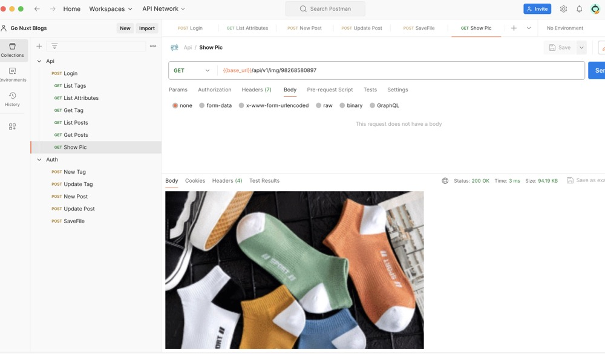

# Go Nuxt Blogs

这是基于 Go + SQLite3 + Nuxt3 的个人博客项目

## 功能介绍

- 登陆
- 创建文章
- 更新文章
- 查询文章列表
- 标签同上
- 路由认证
- 存读Blob数据到SQLite
- 保存图片
- 显示图片

所有博客数据（包括图片和文件）都使用 SQLite3 单文件数据库来存储。

技术栈：

- Go(Golang)
- SQLite3
- Chi
- Gotk
- database/sql (原生sql查询)


- Vue3
- Nuxt3
- Element Plus
- TypeScript
- md-editor-v3(markdown 富文档编辑器)

### 进度介绍

后台服务整体完成，根据需要增加业务；前端开发对接中ing...

### 后台启动

前置：

数据库使用的SQLite3，因此你系统需要安装SQLite3

第一步：

```bash
# 创建数据库和导入表
sqlite3 db.sqlite # 创建数据库文件
.read .schema.sql # 执行sql创建表
```

第二步：

```bash
# 安装项目依赖
go mod tidy

# 启动后台服务
go run main.go
```

第三步：

Postman api 文件在 doc 里，自行导入到postman即可体验




第四步：

如何创建一个用户到数据库？

到 db/userRepo_test.go 填入个信息 执行 TestAddUser 即可创建一个用户，后续文章、标签 CRUD 通过api执行即可。

``` go
func createUser(t *testing.T) int64 {
	user := models.User{
		ID:       int64(gotk.RandomInt(100, 10000)),
		Email:    gotk.RandomString(6) + "@qq.com",
		Username: gotk.RandomString(4),
		Avatar:   "http://" + gotk.RandomString(8),
		Password: gotk.RandomString(6),
	}

	if _, err := user.Hash(); err != nil {
		t.Error(err)
	}
	id, err := testRepo.Users.Create(&user)
	if err != nil {
		t.Error(err)
	}
	if id <= 0 {
		t.Errorf("0 <= %d ", id)
	}

	return id
}

func TestAddUser(t *testing.T) {
	createUser(t)
}
```

### 前端启动

前端基于 Nuxt3，Node 版本需要 18+

``` bash
# 到前端根目录
cd ui 

# 安装依赖
npm install

# 启动前端
npm run dev
```


